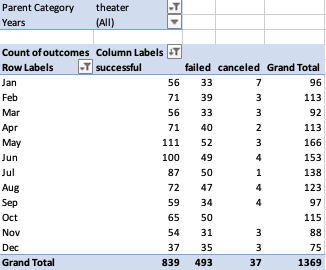

# Kickstarting with Excel

## Overview of Project

### Purpose:
- Using Kickstarter data, this analysis compared how theater campaigns faired given their launch date and their funding goals in an effort to provide my friend Louise with the optimal time and goal amount to launch her own venture. 

## Analysis and Challenges

### Analysis of Outcomes Based on Launch Date
Using a vast dataset from Kickstarter spanning nine years, I created a pivot table in order to analyze campaign outcomes based on their launch dates. Knowing Louise was interested in theater campaigns to act as a point of comparison to her own, I filterd the pivot table on the "theater" category. I also added a "Years" column to the dataset using the following code: =Years(Cell). I included this column as a filter on the pivot table just in case Louise wanted to drill down to a more specific time period. 

I created a PivotChart off of this table in order to provide Louise a visualization on what times of the year over the past nine years had the most successful theater campaigns. 

![Theater_Outcomes_Date] (Theater_Outcomes_vs_Launch.png)

### Analysis of Outcomes Based on Goals
### Challenges and Difficulties Encountered

## Results

### Theater Outcomes by Launch Date:
- Based on the Theater Outcomes by Launch Date analysis, I discovered that the summer months (May - July) could be the optimal time to begin a theater Kickstarter campaign given the high number of successful ventures, especially in the month of May.
- On the other hand, campaigns started at the end of the year seem to be the least successful, especially in the month of December where there are near equal amounts of successful and failed campaigns.

### Outcomes Based on Goals:
- Looking at the Outcomes Based on Goals analysis, I discovered lower funding goals typically lead to greater success, with at least 50% of campaigns designated as successful when having a fundraising goal between $1,000 and $19,999.
- The highest rate of success occurred in the theater campaigns that had a goal of less than $5,000, where at least 73% of the campaigns were successfully funded.

### Limitations of the Dataset:
- Some limitations include:
  - dfadf
