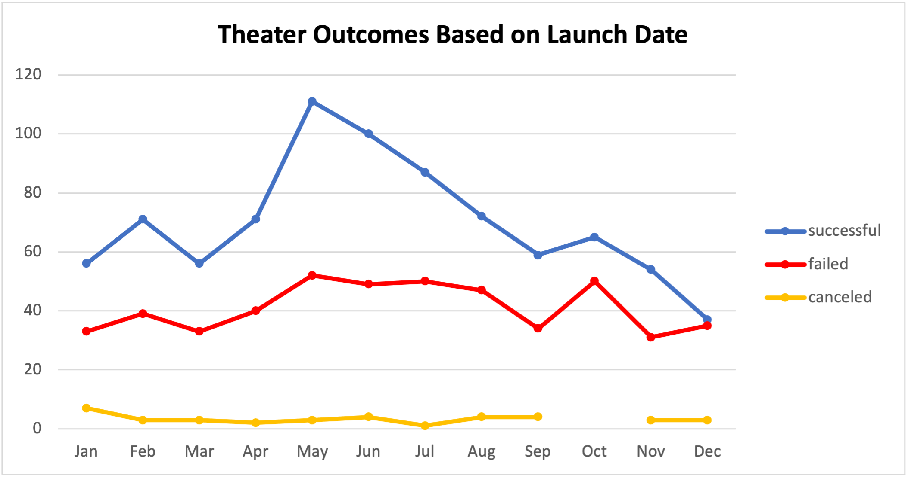
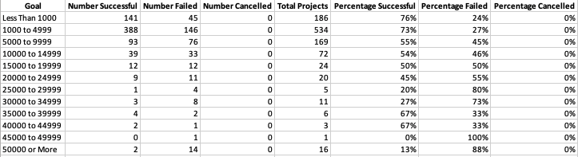
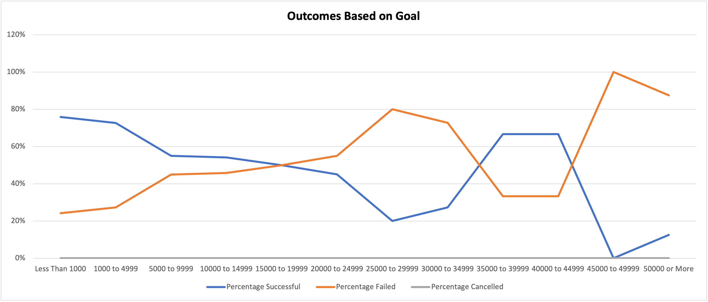

# Kickstarting with Excel

## Overview of Project

### Purpose:
- Using Kickstarter data, this analysis compared how theater campaigns faired given their launch date and their funding goals in an effort to provide my friend Louise with the optimal time and goal amount to launch her own venture. 

## Analysis and Challenges

### Analysis of Outcomes Based on Launch Date
Using a vast dataset from Kickstarter spanning nine years, I created a pivot table in order to analyze campaign outcomes based on their launch dates. Knowing Louise was interested in theater campaigns to act as a point of comparison to her own, I filterd the pivot table on the "theater" category. I also added a "Years" column to the dataset using the following code: =Years(Cell). I included this column as a filter on the pivot table just in case Louise wanted to drill down to a more specific time period. 

I created a PivotChart off of this table in order to provide Louise a visualization on what times of the year over the past nine years had the most successful theater campaigns. 

### Analysis of Outcomes Based on Goals
Using the same dataset from Kickstart, I also wanted to assist Louise in figuring out what the best goal amount would be to ensure her play campaign's success. I first created 12 buckets encapsulating a range of goal amounts to get a better idea of what monetary range led to the highest percentage of successful campaigns. I built the following table to assist in my analysis:

In order to capture the amount of success, failed, and cancelled "plays" campaigns by bucket, I used the following formula: 

=COUNTIFS(Kickstarter!$F$F,"*outcome*",Kickstarter!$R$R,"plays",Kickstarter!$D$D,">=*lower_bound_bucket*",Kickstarter!$D$D,"*upper_bound_bucket*")

This forumula filled columns B through D. I then summed up the total amount of campaigns by bucket to come to the "Total Projects" in Column E by using the =SUM() formula. Next, I calculated the percentages of successful/failed/cancelled campaigns given the total amount of projects captured in each bucket in columns F through H. Finally, I created a line chart to help Louise visualize what range of play campaign goals had the highest percentage of successful campaigns. 

### Challenges and Difficulties Encountered
I personally did not encounter any challenges or difficulties in the analysis, but can think of one potential pitfalls that could've occured:
- The =COUNTIFS() formulas needed to capture a number of variables that could've been missed or incorrectly created, including the "plays" subcategory. I also had to ensure none of the columns double counted any campaigns that were on the higher or lower end of the bucket. For example, I had to include the ">=" for the lower bound, but only "<" for the upper bound.

## Results

### Theater Outcomes by Launch Date:
- Based on the Theater Outcomes by Launch Date analysis, I discovered that the summer months (May - July) could be the optimal time to begin a theater Kickstarter campaign given the high number of successful ventures, especially in the month of May.
- On the other hand, campaigns started at the end of the year seem to be the least successful, especially in the month of December where there are near equal amounts of successful and failed campaigns.

### Outcomes Based on Goals:
- Looking at the Outcomes Based on Goals analysis, I discovered lower funding goals typically lead to greater success, with at least 50% of campaigns designated as successful when having a fundraising goal between $1,000 and $19,999.
- The highest rate of success occurred in the theater campaigns that had a goal of less than $5,000, where at least 73% of the campaigns were successfully funded.

### Limitations of the Dataset:
- Some limitations include:
  - The "theater" and "plays" category/subcategory could've been specified even more to include "genre". This could've helped Louise figure out if there were any speicifc genre's of plays that were more or less successful and how her prospecitive play fared in comparison.
  - The "outcome" column dictated whether a play was "successful" or "failed" in a very binary way, when we don't know how many of the plays had continued success or fizzled out over a short period of time.

### Additonal Tables or Graphs
- I could've included a graph that looked at theater outcomes based on the year to see if theater campaigns were becoming more or less successful over time.
